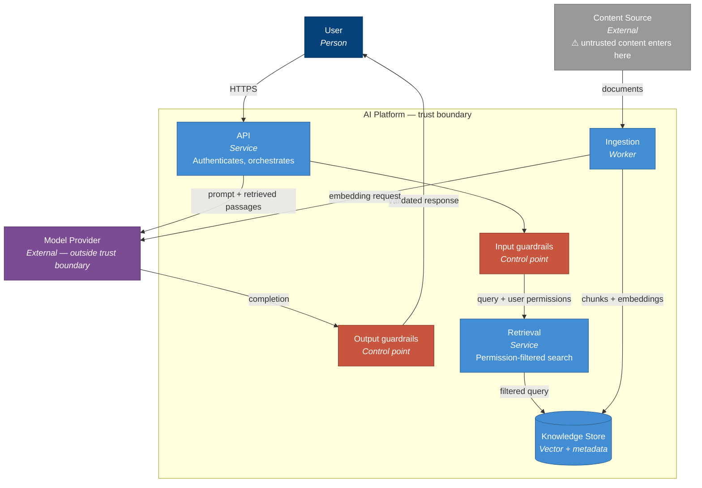

# C4 conventions for AI systems

C4 works well for AI systems, but the standard notation leaves out the things reviewers ask
about: where content becomes untrusted, which components hold model state, and where data
crosses an organisational boundary.

These conventions are deliberately minimal — four additions, and Mermaid so diagrams live in
version control and render natively on GitHub.

---

## Levels to produce

| Level | Produce it? | Purpose |
| --- | --- | --- |
| 1 — System Context | Always | Who uses it, what it depends on. The executive view |
| 2 — Container | Always | Deployable units. The architecture review view |
| 3 — Component | Only for a container with non-obvious internals | Usually the retrieval or orchestration container |
| 4 — Code | Never | The code is the diagram, and it is always out of date on a slide |

Two diagrams satisfy most reviews. A third is occasionally justified. A fourth never is.

## Colour convention

| Element | Fill | Meaning |
| --- | --- | --- |
| Person | `#08427b` | Standard C4 |
| Internal system | `#1168bd` | Standard C4 |
| Container | `#438dd5` | Standard C4 |
| External system | `#999999` | Standard C4 |
| **Guardrail** | `#c8553d` | A control point — makes controls visible on the same diagram as the flow |
| **Model provider** | `#7b4b94` | Always distinct, because it is almost always outside your trust boundary |

## The four additions

1. **Mark the trust boundary** around anything leaving your control — the model provider
   above all. A reviewer's first question is what crosses it.
2. **Show guardrails as nodes, not as annotations.** A control that only appears in prose is
   a control the diagram implies does not exist.
3. **Label edges to the model provider with what is sent** — "query + retrieved passages",
   not "calls API". This single change answers most data-flow questions before they are asked.
4. **Mark where content becomes untrusted.** The ingestion edge is where an attacker-influenced
   document enters. Making it visible turns an abstract threat into a discussion about a
   specific arrow.

---

## Container-level starter

## Why Mermaid

- Renders natively on GitHub — no image export step, so diagrams cannot silently go stale
- Diffs are readable, so a change to the architecture is reviewable in a pull request
- Lives beside the ADRs that justify it
- Requires no licensed tool, which matters when the diagram must outlive the person who drew it

The trade-off is honest: Mermaid gives up fine layout control. For a container diagram that
does not matter. For a slide to a board, export and adjust — but keep the source here as the
version of record.

## Common mistakes

**One diagram showing everything.** If it needs a legend to be read, split it by level.

**Components drawn instead of containers at level 2.** Level 2 shows what deploys and scales
independently. If two boxes always deploy together, they are one container.

**Omitting the model provider.** It is external, it is a dependency, and it is where your
data goes. Draw it.

**Diagrams that describe the plan, not the system.** After launch, the diagram documents what
exists. Mark anything not yet built as planned, explicitly, or the diagram becomes untrustworthy.
