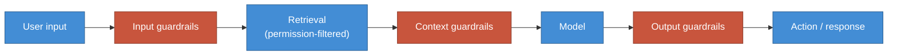

# Guardrails baseline

"Add guardrails" is the most commonly issued and least commonly specified instruction in
enterprise AI. This document makes it concrete: the minimum controls per risk tier, where
each sits in the request path, and how each is verified.

Tiers are defined in [model-certification.md](./model-certification.md).

---

## Where guardrails sit

Four checkpoints. Most implementations build only the first and the third, and the gap at
**context guardrails** is where indirect prompt injection lives.

---

## Baseline by tier

| Control | Where | T1 | T2 | T3 |
| --- | --- | --- | --- | --- |
| Authentication on every request | Input | ● | ● | ● |
| Rate limit per user | Input | ● | ● | ● |
| Token cap per request | Input | ● | ● | ● |
| Budget alert with circuit breaker | Input | ● | ● | ● |
| PII detection and redaction | Input | | ● | ● |
| Prompt injection detection | Input | | ● | ● |
| Topic and scope enforcement | Input | | ● | ● |
| Permission filter applied in the store | Retrieval | ● | ● | ● |
| Retrieved content delimited as data | Context | ● | ● | ● |
| Source allow-list for retrieval | Context | | ● | ● |
| Relevance threshold — refuse if unmet | Context | | ● | ● |
| Schema validation on structured output | Output | ● | ● | ● |
| Encoding before rendering | Output | ● | ● | ● |
| Citation of sources | Output | | ● | ● |
| Sensitive-data scan on output | Output | | ● | ● |
| Groundedness check against retrieved context | Output | | | ● |
| Human approval on irreversible actions | Action | | ● | ● |
| Full audit trail: prompt, sources, output, action | Action | | ● | ● |

---

## Notes on the controls that are usually done wrong

**Permission filters must run inside the store.** Retrieving the top 50 and then discarding
what the user may not see is not access control — it silently returns fewer results, hides
the fact, and leaks existence through timing and result counts. Filter in the query.

**Delimiting retrieved content is not optional at any tier.** It is the cheapest control
available and it is the difference between a document being data and being instructions.
Structure the prompt so retrieved text is unambiguously a payload, and never interpolate it
into the instruction block.

**Injection detection is a detection control, never a prevention control.** It reduces
volume. It will be bypassed. Design so that a successful injection cannot do serious damage,
and treat detection as defence in depth rather than as the defence.

**Refusal is a feature.** A system that answers everything is a system that fabricates. The
relevance threshold that produces "I don't know" is a guardrail, and it should be tuned and
measured like one.

**Token caps prevent denial of wallet.** Without a hard per-request cap, a single crafted
input at maximum context length can cost hundreds of times a normal request. Cap per
request, per user, per period, and alert on the aggregate.

**Audit trails need the sources, not just the output.** When a wrong answer is escalated,
the question is always "where did it get that?" Without the retrieved passages recorded
alongside the completion, that question is unanswerable and the incident cannot be closed.

---

## Verification

A guardrail nobody tested is a guardrail nobody has. For each control, record:

| Control | Implemented where | Test | Owner |
| --- | --- | --- | --- |
| | Component or middleware | Automated test, red-team case, or manual check | Role |

Tier 2 and above should carry a red-team suite in CI: a set of adversarial prompts —
injection, exfiltration, scope escape — that must fail to succeed on every release. Add a
case for every incident found in production. That suite becomes the most valuable artefact
the programme produces.
