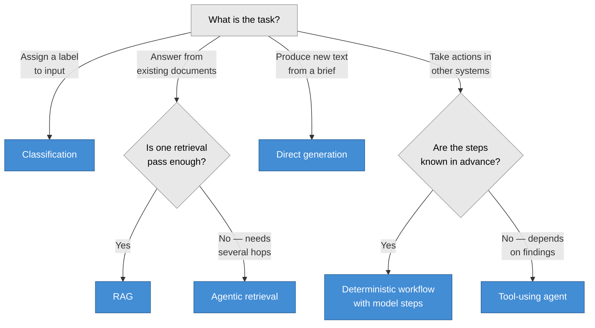

# Pattern catalogue

Choosing the pattern is the highest-leverage decision in an AI project, and it is usually
made by default rather than by analysis — most teams reach for an agent when retrieval would
have done, or for retrieval when a classifier would have done.

Each entry states what the pattern is good at, where it fails, and its typical risk tier.

---

## Choosing

**Bias every branch towards the left.** Each step to the right adds latency, cost, failure
modes, and review burden. The most common architectural mistake in enterprise AI is choosing
an agent for a problem that retrieval solves.

---

## Patterns

### Classification

Assign a label to an input: routing, triage, tagging, sentiment.

**Good at:** high volume, measurable accuracy, cheap, easy to evaluate against a labelled set.
**Fails when:** the taxonomy is unstable or the labels overlap.
**Typical tier:** 1–2, higher if the label affects a person.
**Note:** frequently the right answer when a team has asked for a chatbot. It is boring,
measurable, and it works — and a traditional classifier may beat an LLM on both cost and
accuracy once you have labelled data.

### Direct generation

Model plus prompt, no retrieval: drafting, rewriting, summarising provided text.

**Good at:** low latency, simple to build and operate.
**Fails when:** it needs facts it was not given. It will invent them.
**Typical tier:** 1, rising to 2 if the output is user-facing.
**Note:** if you are tempted to put facts in the system prompt, you need retrieval.

### RAG — Retrieval-Augmented Generation

Retrieve relevant passages, generate a grounded answer with citations.

**Good at:** questions answerable from a document corpus; keeping answers current without
retraining; citations that let users verify.
**Fails when:** the answer requires synthesis across many distant documents, or reasoning
over tables and numbers.
**Typical tier:** 2.
**Reference implementation:** [rag-reference-architecture](https://github.com/prodrigues2023/rag-reference-architecture)

### Agentic retrieval

The model plans its own retrieval: decomposes the question, searches iteratively, refines.

**Good at:** multi-hop questions; corpora where the right query is not the user's phrasing.
**Fails when:** latency matters — several sequential model calls — or when cost per query
must be predictable.
**Typical tier:** 2–3.
**Note:** requires an iteration cap and a terminal state, or it will loop and bill you for it.

### Deterministic workflow with model steps

A conventional workflow where specific steps call a model. The sequence is code.

**Good at:** processes with known steps; auditability; testing each step independently;
failing predictably.
**Fails when:** the path genuinely varies per input.
**Typical tier:** 2–3, by what the workflow touches.
**Note:** this is the pattern most "agent" projects should have been. If you can draw the
flowchart, write the flowchart.

### Tool-using agent

The model chooses which tools to invoke, in which order, based on what it finds.

**Good at:** genuinely open-ended tasks where the steps cannot be enumerated.
**Fails when:** actions are irreversible, cost must be bounded, or behaviour must be
explainable after the fact.
**Typical tier:** 3, almost always.
**Requires:** least-privilege tools scoped to the user, human approval on irreversible
actions, iteration caps, and a complete audit trail. See
[guardrails baseline](../governance/guardrails-baseline.md).
**Note:** the pattern with the widest gap between demo quality and production quality. Adopt
it when you have ruled out the alternatives, not when it sounds exciting.

---

## Combining patterns

Real systems combine them: a classifier routes the request, RAG answers the informational
branch, a deterministic workflow handles the transactional branch, and only the residual
tail reaches an agent.

Routing to the cheapest sufficient pattern is usually worth more than improving any single
one.

## Planned

Worked examples for each pattern arrive in Milestone 2 — see [ROADMAP.md](../ROADMAP.md).
